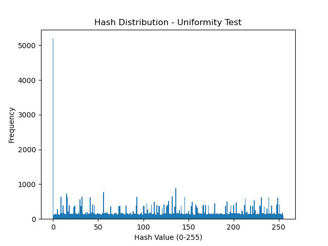
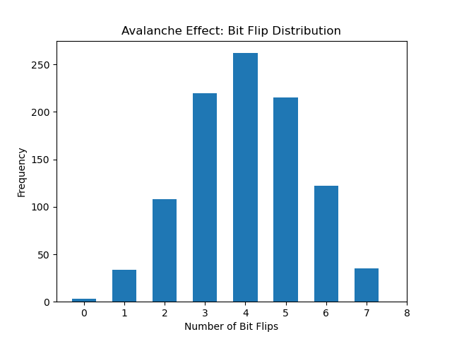

# **HASH FUNCTION PROJECT**

## **Overview**
This project implements and analyzes a simple **8-bit hash function** to explore its properties, including **uniformity, avalanche effect, and collision resistance**. The project is divided into three main tasks:

✅ **6a – Implement a Simple Hash Function**  
✅ **6b – Evaluate Uniformity and Avalanche Effect**  
✅ **6c – Demonstrate Insecurity through Collision Analysis**  

## **Project Structure**
```
HASH_FUNCTION_PROJECT/
│── 📂 images/          # Images of matplotlib output
│── 📂 src/             # Source code for hash function and tests
│   ├── avalanche.py     # Avalanche effect test
│   ├── hash_function.py # Simple hash function implementation
│   ├── insecurity.py    # Collision analysis
│   ├── uniformity.py    # Uniformity test
│── 📂 test_files/       # Input test files
│   ├── Avalanche_test.txt   # Test cases for avalanche effect
│   ├── Uniformity_test.txt  # Input for uniformity test
│── 📜 .gitignore        # The Git ignore file
│── 📜 main.py          # Entry point for running all tests
│── 📜 README.md        # Project documentation (this file)
```

---

## **Installation & Setup**
### **🔹 Prerequisites**
- Python 3.x
- Matplotlib (for visualizations)
- Collections module (built-in Python library)

### **🔹 Install Dependencies**
Run the following command to install Matplotlib if you don’t have it installed:
```bash
pip install matplotlib
```

---

## **How to Run**
Execute the main script to run all tests:
```bash
python3 main.py
```
This will:
1. **Run the Uniformity Test** – Checking hash distribution.
2. **Run the Avalanche Effect Test** – Measuring how sensitive the hash function is to small input changes.
3. **Run the Collision Test** – Finding and analyzing hash collisions.

---

## **Test Explanations**
### **🔹 Uniformity Test (`uniformity.py`)**
- Reads lines from `Uniformity_test.txt`.
- Hashes each line and tracks bucket distribution.
- Uses **Matplotlib** to visualize the hash distribution across 256 buckets.

### **🔹 Avalanche Effect Test (`avalanche.py`)**
- Reads `assignment1_Avalanche_test.txt`.
- Modifies characters in test strings to measure **bit flips** in the hash.
- Plots a histogram of bit flip frequencies using **Matplotlib**.

### **🔹 Collision Test (`insecurity.py`)**
- Hashes multiple lines from `Uniformity_test.txt`.
- Identifies **collisions (same hash for different inputs)**.
- Tracks total and unique collisions to assess hash function security.

---

## **Expected Output & Interpretation**

### **Uniformity Test Output (Example Histogram)**
✔ A good hash function should **spread values evenly** across all 256 buckets.
✔ If some buckets are overloaded, the hash function is **not distributing well**.

The following histogram shows the hash distribution from our tests:



### **Avalanche Effect Output (Example Histogram)**
✔ A strong hash function should **flip ~50% of bits** when input changes slightly.
✔ If bit flips are too low, the hash function is **too weak**.

The following histogram shows the bit flip distribution from our tests:



### **Collision Test Output (Example Summary)**
```plaintext
🔹 Finding Collisions (Proving Insecurity)...
Total unique collisions: 256
Total collision occurrences: 64,863
Max collisions in a single bucket: 5193
Average collisions per occupied bucket: 253.37
```
✔ If many different inputs hash to the same value, the function is **not cryptographically secure**.
✔ High collision counts confirm that an **8-bit hash is too small** for security applications.

---

## **Conclusions**
This project demonstrates that **while the hash function works for general hashing, it is not cryptographically secure**.
✔ The **uniformity is fairly good**, though small tweaks improved distribution.
✔ The **avalanche effect is well-balanced**, meaning small changes in input cause widespread bit flips.
✔ The **collision rate is high**, proving this hash function is **unsuitable for security applications** but useful for learning purposes.

---

📌 This project is part of a **Computer Security course assignment** for Linnaeus university.

